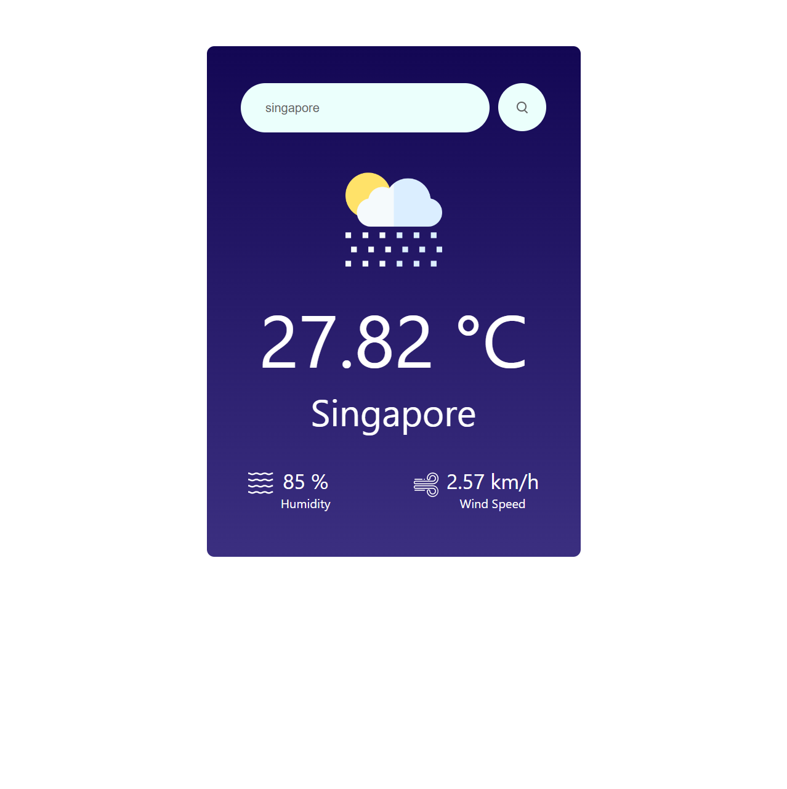

# Weather Forecast App
This web-based weather forecast application, crafted with a minimalist design using React, effortlessly incorporates the OpenWeather API. It aims to furnish precise weather updates, covering key aspects like temperature, wind speed, and humidity. Its central goal is to furnish users with current weather insights and forecasts in a seamless manner.

## Live Demo
https://weather-wenhaoyu.com/

## Techniques Used
• React.js Framework.
• Restful APIs with OpeanWeather.

## Local Installation
To run the Weather Forecast App locally, follow these steps:
### 1. Clone this repository:
`git clone https://github.com/Ryannn41/Weather-Forecast-App.git`

### 2. Navigate to the directory:
`cd weather-app`

### 3. Install all the dependencies:
`npm install`

### 4. Go to OpenWeather and generate your own key:
`https://openweathermap.org/api`

### 5. Replace with your own key and start:
`npm start`

## Functionality
### Weather Forecast: 
Provide accurate weather information, encompassing details such as temperature, wind speed, and humidity.

### Real-time Updates: 
The application consistently retrieves data from the OpenWeather API, guaranteeing that the weather details are always current.

### Preview

